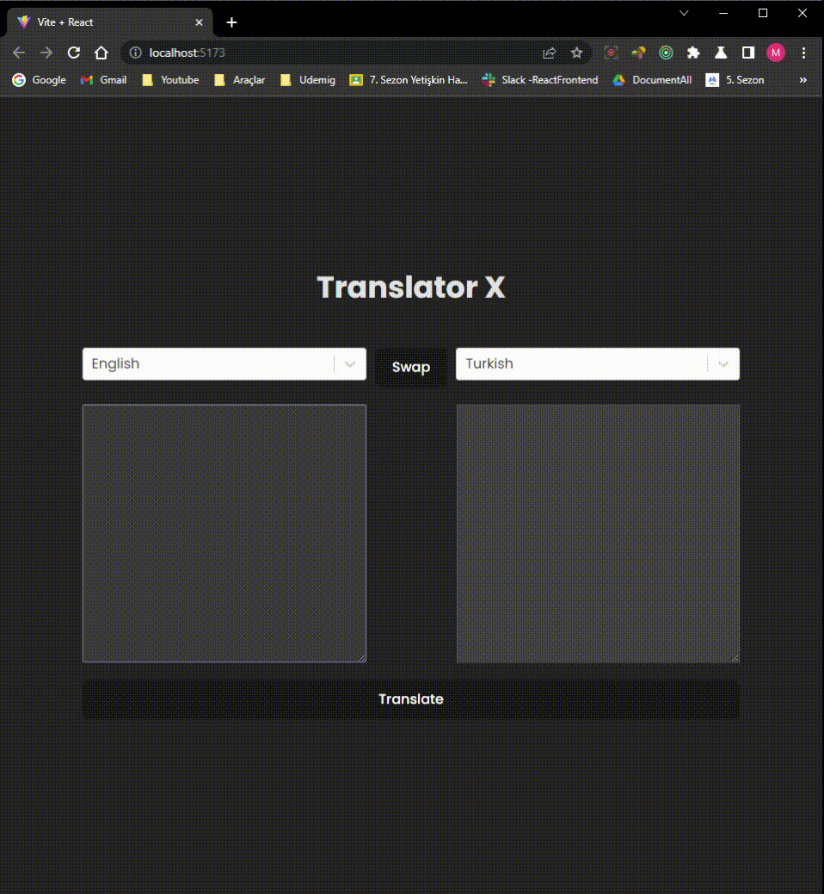

# Translate Redux TK AsyncThunk

<h1>Translate X Application with Redux TK AsyncThunk</h1>

<h3>This libraries have been used -react-redux, @reduxjs/toolkit|| -axios || -axios ||  -react-select || -sass||</h3>

<h3>This hooks have been used  --createAsyncThunk || --createSlice || --configureStore || -useMemo|| --axios || --useDispatch ||--useSelector ||  -useRef || --Provider || --useEffect|| --useState|| </h3>

